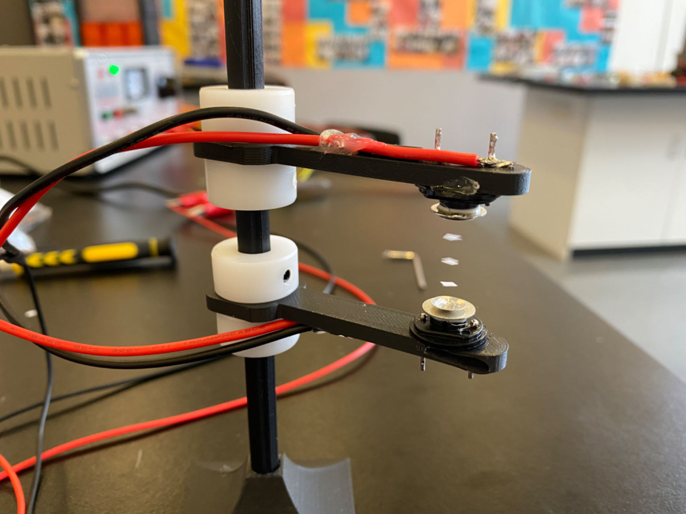
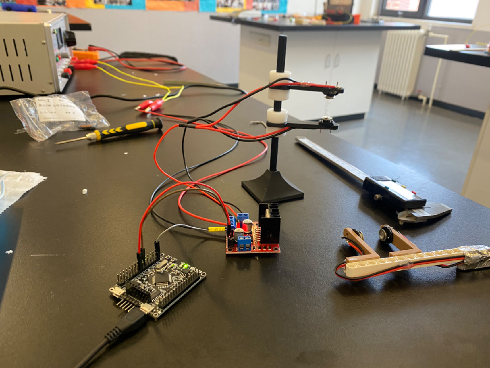

# Ultrasonic Levitation Device

This project is a high school physics demonstration instrument for standing waves, capable of levitating small pieces of paper or debris in mid-air. The device primarily uses an L298N motor driver module and an STM32F103C6-based development board, along with an RT ultrasonic generator. The development board generates PWM signals, which are amplified by the motor driver module and then used to drive the RT ultrasonic generator, creating standing waves in the air.

## Project Structure

- **src**: Contains the Keil uVision project files. The project is named `bobowayve` (named after my friend Bobo).
- **imgs**: Contains images for the project documentation.
  - `Hovering.jpg`: Image of the device levitating small pieces.
  - `Building.jpg`: Image showing the construction of the device.

## Components Used

- **L298N Motor Driver Module**: Used to amplify the PWM signals.
- **STM32F103C6 Development Board**: Used to generate the PWM signals.
- **RT Ultrasonic Generator**: Used to produce the standing waves in the air.

## How It Works

1. The STM32F103C6 development board generates PWM signals.
2. These PWM signals are sent to the L298N motor driver module for amplification.
3. The amplified signals drive the RT ultrasonic generator.
4. The ultrasonic generator creates standing waves in the air, allowing small pieces of paper or debris to levitate.

## Images


*The device levitating small pieces of paper.*


*The construction of the ultrasonic levitation device.*

## Installation and Usage

1. Clone the repository to your local machine.
   ```bash
   git clone https://github.com/ZiJie-Duan/Ultrasonic-Suspension-Drive.git
